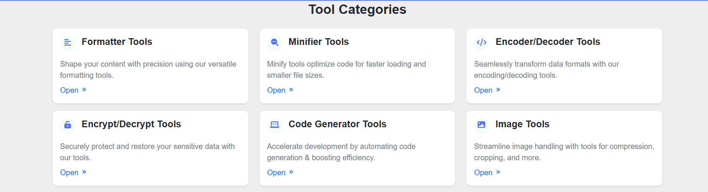
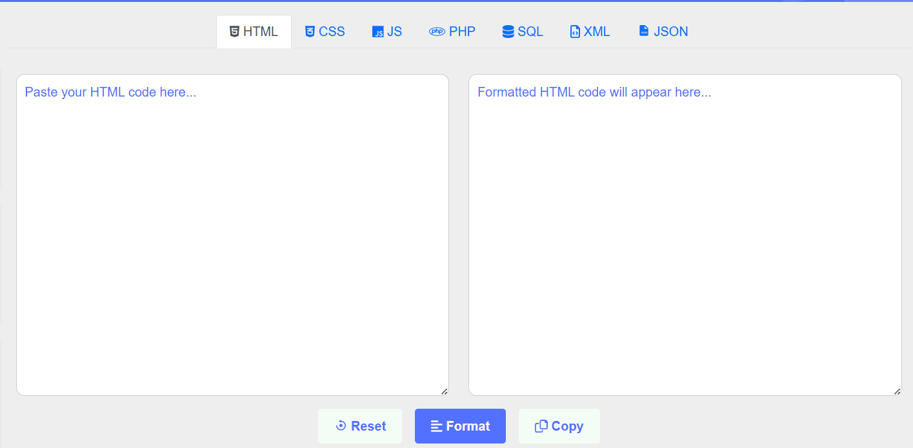

# 🧰 Aurora Tools

A collection of lightweight, browser-based tools built during my internship at Aurora Web Labs. These tools are designed for developers and students to speed up routine coding tasks — like formatting, minifying, encoding, and generating structured code.

---

## 🚀 Features

Aurora Tools includes:

- 🧹 **Formatters**
  - HTML Formatter
  - CSS Formatter
  - JavaScript Formatter
  - PHP & SQL Formatter

- 📦 **Minifiers**
  - CSS Minifier
  - JavaScript Minifier

- ⚙️ **Generators**
  - HTML Table Generator
  - Grid Layout Generator
  - URL Slug Generator
  - Lorem Ipsum Generator
  - Regex Generator

- 🔐 **Encoders / Decoders**
  - JWT Encoder/Decoder
  - URL Encoder/Decoder
  - HTML Encoder/Decoder

- 🌳 **Utilities**
  - JSON Tree Viewer
  - Color Picker
  - Password Generator
  - UUID Generator

---

## 💻 Tech Stack

- **HTML5, CSS3, JavaScript**
- Clean and responsive UI using custom styling (no frameworks)
- Modular structure for easy integration into any web app

---

## 📸 Screenshots

| Home Page | Example Tool |
|-----------|--------------|
|  |  |

---

## 🗂 Folder Structure

```bash
aurora-tools/
├── formatters/
├── generators/
├── encoders/
├── utils/
├── index.html
├── styles.css
├── script.js
├── assets/
├── README.md
└── .gitignore
